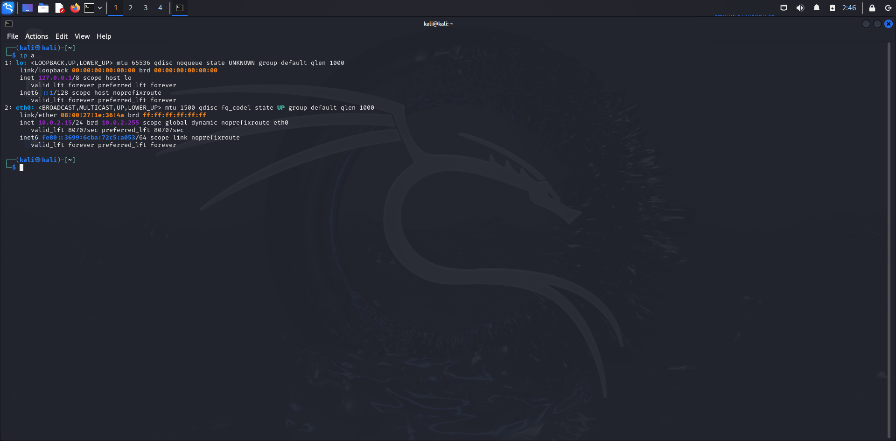

## 🧑‍💻 Melvin Cyber Portfolio

Hands-on IT Support & Cybersecurity learner with practical experience in Linux, networking, and security labs.

---

### 🔧 Skills
- Linux (Ubuntu installation, terminal usage)
- Networking basics (IP, DNS, Ports)
- System troubleshooting
- Basic web security (XSS, SQL Injection)

---

### 💻 Practical Work

#### 🐧 Linux Setup
- Installed Ubuntu using VirtualBox  
- Used terminal commands  
- Managed basic file permissions  

#### 🌐 Local Server
- Ran localhost server (127.0.0.1:8080)  
- Tested in browser  
- Fixed port issues  

#### 🛡 Cybersecurity Practice
- Practicing labs on TryHackMe  
- Learning Linux, networking, and vulnerabilities  

---

### 🛠 Tools
- VirtualBox  
- Ubuntu Linux  
- Terminal  
---

### 📸 Proof

